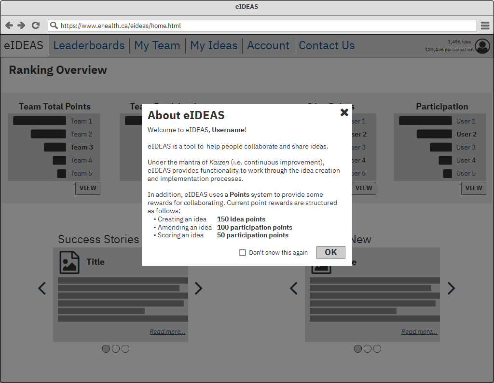
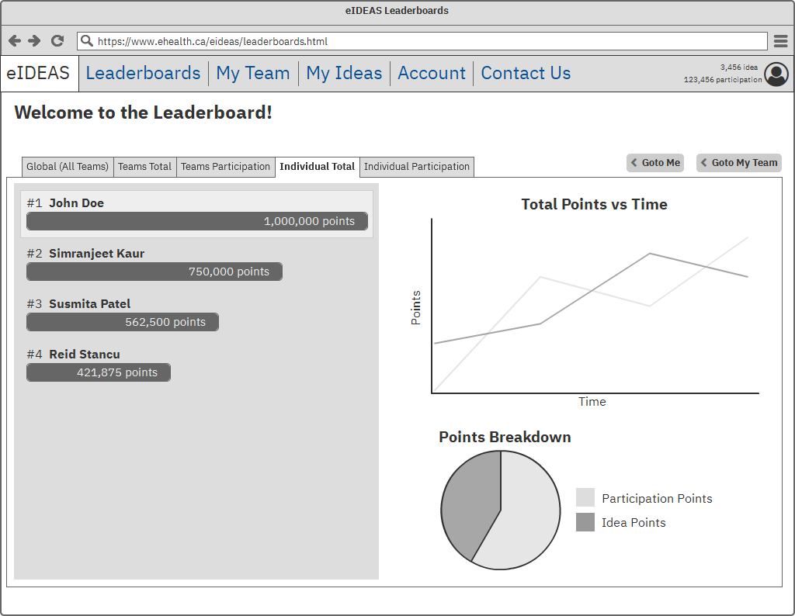
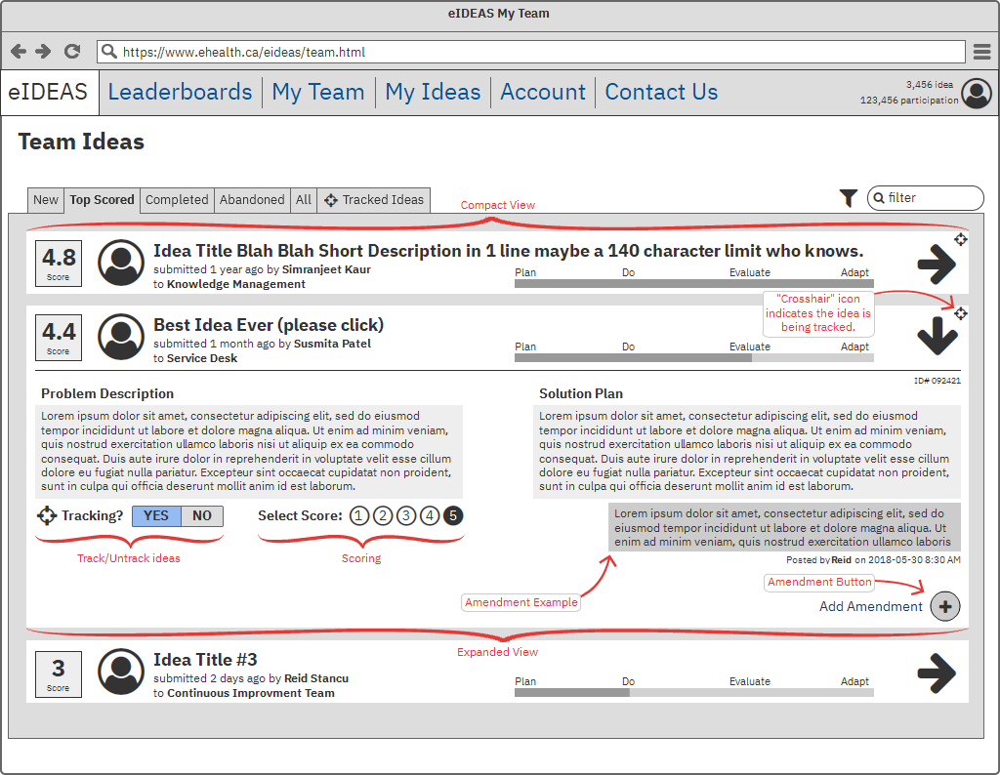
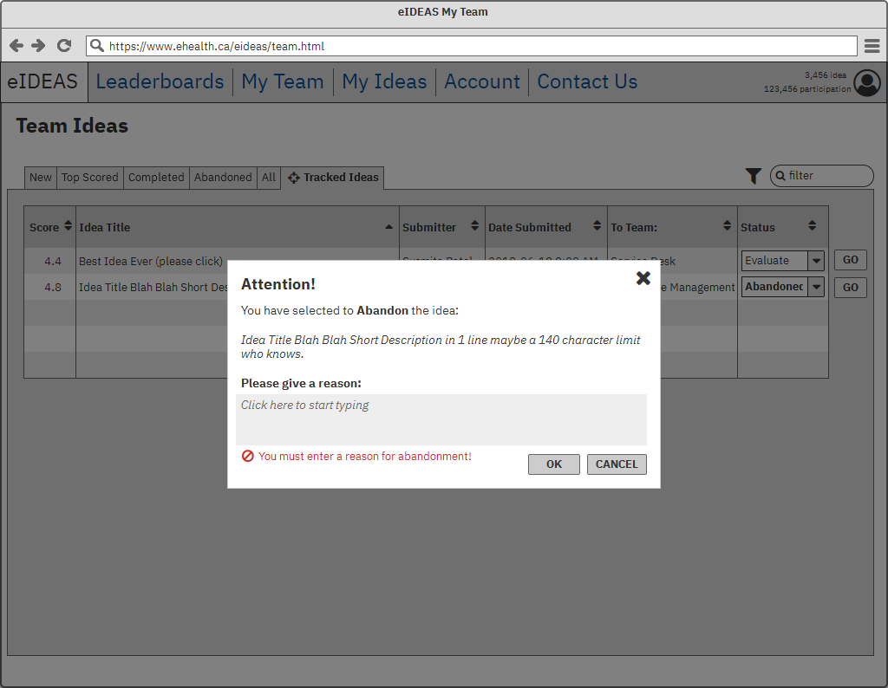
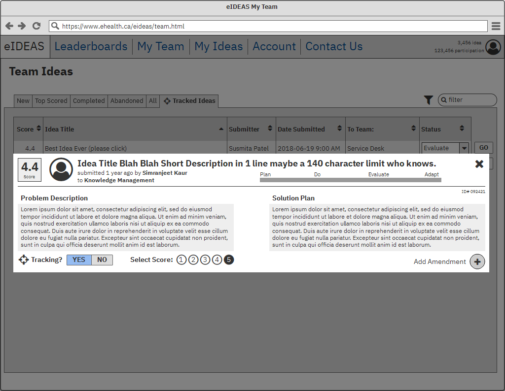

  
  

    

**Authors:** Reid Stancu, Simranjeet Kaur, Susmita Patel

# Discussion
The purpose of this document is to outline design decisions as well as some potential problems with respect to Braintrust's eIDEAS project. This document attempts to answer the _why_ questions new readers may have.

<!-- START doctoc generated TOC please keep comment here to allow auto update -->
<!-- DON'T EDIT THIS SECTION, INSTEAD RE-RUN doctoc TO UPDATE -->
**Table of Contents**

  - [1 Points System](#1-points-system)
    - [1.1 Motivation](#11-motivation)
      - [Users are motivated by earning physical rewards](#users-are-motivated-by-earning-physical-rewards)
      - [Users are motivated by progression](#users-are-motivated-by-progression)
      - [Users are motivated by competition](#users-are-motivated-by-competition)
      - [Flexibility to Managers](#flexibility-to-managers)
      - [Easy to track Organizational Progress](#easy-to-track-organizational-progress)
    - [1.2 Structure](#12-structure)
      - [Idea Points](#idea-points)
      - [Participation Points](#participation-points)
      - [Reasoning](#reasoning)
      - [Potential Problems](#potential-problems)
    - [1.3 Other Information about Points](#13-other-information-about-points)
  - [2 Design](#2-design)
    - [2.1 Login](#21-login)
    - [2.2 Registration](#22-registration)
    - [2.3 Homepage](#23-homepage)
      - [2.3.1 About eIDEAS pop-up](#231-about-eideas-pop-up)
    - [2.4 Leaderboard](#24-leaderboard)
    - [2.5 Ideas](#25-ideas)
      - [2.5.1 Scoring](#251-scoring)
      - [2.5.2 Amendments](#252-amendments)
      - [2.5.3 My Ideas](#253-my-ideas)
      - [2.5.4 My Team](#254-my-team)
        - [Tracking Ideas](#tracking-ideas)
        - [PDCA/PDEA Progress](#pdcapdea-progress)
    - [2.6 Account](#26-account)
    - [2.7 Contact Us](#27-contact-us)
    - [2.8 Admin](#28-admin)
  - [3 User Help](#3-user-help)
    - [3.1 Pop-up information](#31-pop-up-information)
    - [3.2 Mouseovers](#32-mouseovers)
  - [4 Other Ideas](#4-other-ideas)
    - [4.1 User Badges](#41-user-badges)
    - [4.2 Report Generation](#42-report-generation)
  - [5 Potential Problems](#5-potential-problems)
    - [5.1 Management bottleneck w.r.t. processing ideas](#51-management-bottleneck-wrt-processing-ideas)
    - [5.2 Duplicate Ideas](#52-duplicate-ideas)

<!-- END doctoc generated TOC please keep comment here to allow auto update -->

## 1 Points System
The primary function of the point system is to provide some rewards for collaborating. In addition the point system provides various types of motivations which incentivize users to return.

### 1.1 Motivation
The motivations for choosing a points system are described below.

#### Users are motivated by earning physical rewards
This is one of the strongest motivators for users. Motivation is strongly correlated with the quality of the physical reward. For example, a new car is more motivating than a new water bottle.
#### Users are motivated by progression
Users like seeing themselves improve. Having a point system allows users to see how they are progressing compared to their past selves. If they are improving, they will be happy with themselves. If they are not improving, they might find this fact as a decent motivator.
#### Users are motivated by competition
Competition can also be a strong motivator. Many people like comparing themselves to others because it shows the potential gap between them (i.e. room for improvement). If there is room for improvement, people will tend to seek it out.
#### Flexibility to Managers
Managers have flexibility with a point system because the points and rewards themselves can be chosen arbitrarily. For example, managers can select a range of points over time in order to evenly distribute physical rewards while still respecting a budget. This allows the "reward path" to be shaped from the budget and not the other way around.
#### Easy to track Organizational Progress
This is primarily a benefit for Upper Management. Having a point system implies many statistics and metrics about points are already being tracked. This makes it trivial for Upper Management to receive a report out regarding progress. Number of ideas, rate of improvement (individual & team), rate of failure, top contributors, and many others are examples of things that are implicitly tracked.

### 1.2 Structure
The structure of the point system provides two ways of measuring progress. The first way is **Idea Points**, which corresponds directly to progression of ideas themselves. The second way is **Participation Points**, which corresponds to user engagement.
#### Idea Points
Idea Points are collected by users each time an idea is submitted or completed. These are the "primary currency" with respect to rewards, and as such, are harder to obtain. Being harder to obtain necessitates greater rewards, so managers must mindful of this.
#### Participation Points
Participation Points are collected by users each time they engage with an idea in the system. These are the "secondary currency" with respect to rewards, and are easier to obtain than Idea Points. Therefore, rewards for Participation Points should be lesser, but more frequent to promote consistent user engagement. Users may obtain Participation Points by engaging in any action regarding an idea. These actions can be (but are not limited to): scoring an idea, adding an amendment to an idea, creating an idea, moving an idea through it's phases (i.e. PDCA/PDEA).
#### Reasoning
Splitting points into two types provides some advantages. Some users may not be as creative as others, so they may not be able to accumulate as many Idea Points. Participation Points give these users a stable way to receive rewards by still providing contributions to the system. Further, having Idea Points to measure the creation and completion of ideas is a straightforward way to track the primary goals of the system.
#### Potential Problems
To compensate for varying team size, points must be scaled accordingly. For example, if normalization is not used, large teams will surely dominate as they have more potential to generate ideas. To allow for a meaningful comparison with respect to teams, each team's cumulative points must be scaled by the size of the team. This is a non-perfect solution, but should work well enough to provide users with competitive motivations. It is important to have meaningful comparisons in competition in order to promote team work.

Normalization is not needed for the individual since comparing individuals is straightforward.
### 1.3 Other Information about Points
Users are provided information about points in various places in the eIDEAS system. One place is the "About eIDEAS" pop-up (see section [Section 2.3.1](#231-about-eideas-pop-up)) that displays when a user first logs into the system. Other places have yet to be determined, but there certainly should be a central area that explains to the user how to earn points, how many points an action rewards, and how many points the user has accumulated as well as their "reward track".

The structure of points will be decided by Administrators via the tools on the Admin page. This will be where exact point values for each action will be entered.
## 2 Design

### 2.1 Login
This is a standard login screen with email address and password fields. This screen also links to the registration page. Additionally, a link is set up for Forgot Password; however, this page is not implemented at present.

### 2.2 Registration
This is a standard registration page which consists of: first & last names, email address, password, and confirm password. In addition, the fields Division and Unit are added to satisfy eHealth's organizational requirements.

**Units** (or Teams) are the smallest level of grouping at eHealth. For example, the following are Units at eHealth: Knowledge Management, Finance, Continuous Improvement, Service Desk.

**Divisions** (or Departments) are the next largest grouping, that is, there are multiple Units per Division. Currently, for this project, we are using "eHealth" as a placeholder for Division.

**Note:** Both Units and Divisions are to be managed (e.g. add/edit/delete) by an Administrator via the Admin page. These values are used to populate the drop-down/combobox lists in the Registration page.

### 2.3 Homepage
After the user has logged in, they are automatically redirected to this page. If the user has never logged into the system before, the "About eIDEAS" pop-up will be displayed (see section [Section 2.3.1](#231-about-eideas-pop-up)).

**Ranking Overview** occupies the top half of the page. This section provides a snapshot of team and individual points. The intention is to give users a quick look at the current standings so that they can compare how well they (or their team) are doing. This was well received in the [usability evaluation](./Lo-Fi%20Usability%20Evaluation/milestone3_usability_report.pdf).

**Success Stories** (bottom left) are meant to show notable achievements  so that other users may be inspired.

**What's New** (bottom right) is meant to provide users with up to date information and facts regarding eIDEAS.

#### 2.3.1 About eIDEAS pop-up
The eIDEAS pop-up is valuable to new users as it provides some context about eIDEAS, the points system, and the rewards structure. This pop-up can be disabled at any time if the user selects the "Don't show this again" checkbox.

### 2.4 Leaderboard
This page enables users to track their progress using statistics and charts. It allows users to accurately compare themselves (and their teams) to each other. This is important to in order to keep competitiveness maintained.

The statistics needed for this page are also valuable for Management. These calculations enable Management to generate reports which can describe the overall progress of Units, Divisions, or eHealth entirely.

### 2.5 Ideas
For an idea to be accepted into the eIDEAS system it must have a **Problem Description** and a proposed **Solution Plan**. Both of these fields are hidden in the default (i.e. compact/minimized) view. This is done to save vertical space and to avoid bombarding users with too much information at once. In the expanded view these fields (and more) are visible (refer to FR2-1.1 in the [requirements document](./requirements.md)).

Ideas should be filterable by the fields listed in FR2-1.1 in the [requirements document](./requirements.md).

#### 2.5.1 Scoring
Scoring allows all users indicate the relative importance of an idea. The value or importance of an idea is implicitly captured by Scoring. This can help Managers and users to make decisions about ideas. For example, Scoring can help answer the following questions:

* Which ideas should be processed first?
* Which ideas should I contribute to?
* Which ideas need to be refined more?
* Which ideas are most likely to succeed or fail?

Scoring is limited from 1 to 5 (1-worst, 5-best) to make selecting a score easy. Users should not have to deliberate extensively in order to assign a Score.

Each idea score is simply the calculated average of each users assigned score number.

#### 2.5.2 Amendments
The **Add Amendment** button provides users with the ability to suggest minor changes to the idea. These suggestions can: improve the idea, make the idea more fair or accurate, and keep the idea up-to-date.

This feature is in line the eIDEAS mantra _Kaizen_ as it enables small incremental improvements during the Plan and Evaluate phases of PDCA/PDEA.

**Note:** The Add Amendments button should only be enabled during the Plan and Adapt phases.

#### 2.5.3 My Ideas
The **My Ideas** page shows all of ideas that the individual user has submitted. Users can create ideas on this page and submit them (or save them as a draft).

If the number of ideas is too large to display in one screen, pagenation (or infinite scroll) should be used.

#### 2.5.4 My Team
The **My Team** page shows all of the team ideas organized into various tabs. Any idea can be displayed here, including ideas from other teams. Users can filter this page by any field from FR2-1.1 in the [requirements document](./requirements.md).

Typically this is where users will start tracking ideas they are interested in.

Similar to any other page where ideas are displayed; users can track, score, and add amendments in the same way.

If the number of ideas is too large to display in one screen, pagenation (or infinite scroll) should be used.

#### Tracking Ideas
Users are able to track ideas that are of interest to them. This allows users to collect ideas and quickly visualize them.

Users can track and untrack ideas at any time. If a Manager or delegate (see Section [5.1](#51-problem-1-management-bottleneck-wrt-processing-ideas)) has an idea tracked, they can change the PDEA status via drop-down menu.

A "crosshair" icon is displayed in the top right of any idea that the current user has tracked. In addition, any tracked idea is view-able from the **Tracked Ideas** tab.

#### PDCA/PDEA Progress
The PDEA status of an idea can be progressed by tracking an idea and viewing it in the **Tracked Ideas** tab. If the user has proper credentials (e.g. Manager or delegate), then a drop-down will be available to change the status. If the user does not have proper credentials, the drop-down will be disabled (but still visible).

Normal users should not be allowed to change their own PDEA status. Reasoning for this is outlined in Section [5.1](#51-problem-1-management-bottleneck-wrt-processing-ideas).

**Note:** For our mockups we have decided to change **P**lan **D**o **C**heck **A**ct (PDCA) to **P**lan **D**o **E**valuate **A**dapt (PDEA) as we feel "Evaluate" and "Adapt" are more easily understood.

### 2.6 Account
This page hasn't been designed yet, but should include basic user account functionality (e.g. change password). See Table 8 in the [Requirements Document](./requirements.md) for more information.

### 2.7 Contact Us
This page hasn't been designed yet, but should include basic information about eIDEAS. See FR5-2.4 and FR5-2.4.1 in the [Requirements Document](./requirements.md) for more information.

### 2.8 Admin
This page hasn't been finished yet (see last page in mockup [PDF](./mockups/eideas.pdf)).

Administrators are able to decide the point structure. That is, how many points a user gets for completing a given action. For example, adding an idea, amending an idea, scoring an idea, etc.

See Table 7 in the [Requirements Document](./requirements.md) for more information

## 3 User Help
### 3.1 Pop-up information
Various pop-up dialogues are used to guide users and explain the consequences of each action (e.g. a button click).

In addition, various pop-ups are used for taking user input (e.g. create idea, reason for abandonment). Further, in the case of the **Tracked Ideas** tab, clicking on an idea displays it in it's full interactive view as a pop-up.

Pop-ups should be included to show when a user has accumulated points (e.g. "you have received 100 idea points").

### 3.2 Mouseovers
Add mouseover tips for the idea expansion arrow to explain that it can be clicked (e.g. "show more").

## 4 Other Ideas
This section outlines features that are not currently implemented, but are desired for a future release.

### 4.1 User Badges
Add badges to user profile picture as another motivator. Badges should be earned by accumulating a certain amount of points. There should be multiple badges depending on the amount of points (e.g. Gold, Silver, Platinum, etc).
### 4.2 Report Generation
Have buttons to generate weekly/monthly/yearly reports about the number of ideas submitted/completed/abandoned etc. The exact content of these reports should be determined by the needs of eHealth.

## 5 Potential Problems

### 5.1 Management bottleneck w.r.t. processing ideas

**Description:** Managers may be overburdened by the amount of ideas they have to process if they must move the PDEA status for every idea for each team they manage.

**Suggestions:**

  1. Allow all users to move the PDEA status with no restrictions.
      * **Pros:** Manager will be completely burden-free as any user can progress the PDEA cycle.
      * **Cons:** If every user can progress an idea along then there will be users who abuse the system to maximize their points. For example, create "dummy" idea and move it to completion instantly in order to collect points.

  2. Emphasize somewhere (e.g. About eIDEAS pop-up on homepage) that Managers are not required to process every single idea submitted. Suggest that they process some number of ideas per week (e.g. 5 per week). These ideas can be selected at the Manager's discretion (e.g. choose "top ideas" as ranked by Score).
      * **Pros:** The load on Manager is lightened as they are not obligated to process every single idea. In addition, Managers have some choice w.r.t. which ideas should (or can) be completed first.
      * **Cons:** By not requiring every idea to be processed, some ideas may be forgotten. The suggested "ideas per week" is a number that must be selected carefully --- too high and the Manager is overburdened; too low and ideas may not see any progression (i.e. they get "stuck" in the queue).

  3. Managers can designate another user from their team (or multiple if they are part of more than one team) to act on their behalf to move the PDEA status. This should be limited to team size in order to avoid (1) above. For example, a manager can assign 1 delegate per 10 members of their team (i.e. team size of 10 -> 1 delegate, team size of 20 -> 2 delegates, etc).
      * **Pros:** This distributes the work load across multiple people, therefore lowering the burden of the Manager. This also avoids the problem of (1) where users can abuse the system via "dummy" ideas.
      * **Cons:** The amount of delegates per team should be selected carefully --- too many delegates may lead to abuse of the points system; too few and the work load is not adequately distributed. Assigning delegate(s) is itself work, so it is another thing Managers have to do.

**Recommendations:**

Use a combination of (2) and (3). Start with (2) and observe the suggested "ideas per week" number. If the Manager cannot process this number of ideas per week such that the amount of "forgotten"/"stuck" ideas is minimal, use (3) and introduce delegates.

This recommendation overcomes the problems of (1), while also solving the manager bottleneck issue. For most teams (small), suggestion (2) might be sufficient. If (2) is not sufficient (e.g. for large teams), adding delegates from (3) provides flexibility to mitigate potential "forgotten"/"stuck" ideas that may be introduced by (2).

### 5.2 Duplicate Ideas

**Description:** Many duplicate ideas can cause clutter, therefore, a mechanism to minimize them should be provided.

**Suggestion:** Add a way for users to "mark as duplicate". The user should provide the ID of the duplicate idea. This should be reviewed/verified by a Manager or Administrator. Once the verification is complete (if it is a duplicate) the Administrator should delete the duplicate submission.
